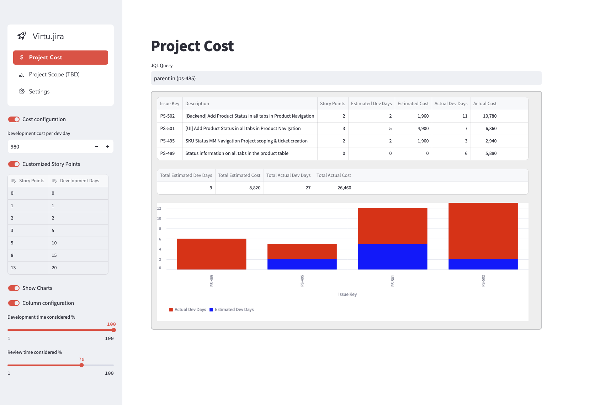
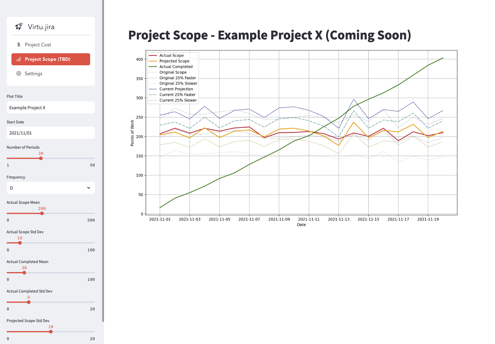
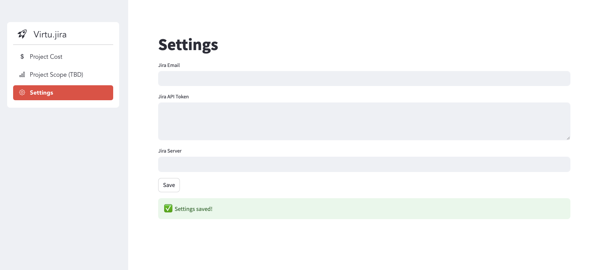

# Virtu.jira

[](https://virtu-jira.streamlit.app/)

**Virtu.jira** is a powerful tool designed to streamline project management by providing a seamless interface for searching and analyzing Jira issues. With its ability to calculate project costs based on development and review time, Virtu.jira simplifies project planning and budgeting, making it an indispensable asset for agile teams and project managers.

[](https://www.buymeacoffee.com/rfonseca85)

## Table of Contents

- [Features](#features)
- [Installation](#installation)
- [Usage](#usage)
- [Contributing](#contributing)
- [License](#license)

## Features

### 1. Jira Issue Search

Easily search for Jira issues using various search criteria, including project, status, assignee, and more. Get real-time results and view detailed information about each issue.

### 2. Project Cost Calculation

Virtu.jira can calculate the cost of a project based on the estimated development and review time for each issue. It helps project managers make informed decisions and allocate resources efficiently.



### 2. Project Scope and Completion

Comming Soon



### 3. User-Friendly Interface

The user-friendly interface ensures that both beginners and experienced Jira users can navigate the tool effortlessly. Intuitive design and clear instructions make it easy to get started.

### 4. Customizable

Tailor Virtu.jira to your needs by configuring search criteria and cost calculation settings. Personalize the tool to match your team's workflow.

### 5. Cross-Platform Compatibility

Virtu.jira is compatible with multiple operating systems, ensuring that you can use it on your preferred platform, whether it's Windows, macOS, or Linux.

## Installation

To run Virtu.jira using Docker, follow these steps:

1. Clone the repository to your local machine.

2. Navigate to the project directory.

3. Build the Docker image (replace `jira_explorer_app` with your desired image name):

   - Use the following command to build the Docker image:

     ```
     docker build -t jira_explorer_app .
     ```

4. Run the Docker container (mapping port 8501 to your host machine):

   - Use the following command to run the Docker container:

     ```
     docker run -p 8501:8501 jira_explorer_app
     ```

   Virtu.jira will be accessible at `http://localhost:8501` in your web browser.

5. Configure the project 




## Usage

1. Launch Virtu.jira by following the installation steps.

2. Use the search functionality to find Jira issues that match your criteria.

3. Configure project cost calculation settings to estimate the project's development and review time.

4. Review the calculated project cost and make informed decisions for project planning and budgeting.

5. Explore additional features and customize Virtu.jira to suit your needs.

## Contributing

We welcome contributions to Virtu.jira. To contribute, follow these steps:

1. Fork the repository.

2. Create a new branch for your feature or bug fix.

3. Implement your changes and ensure all tests pass.

4. Commit your changes.

5. Push your changes to your fork.

6. Create a pull request to the `main` branch of the original repository.

Please make sure to follow our [code of conduct](CODE_OF_CONDUCT.md) and [contribution guidelines](CONTRIBUTING.md).

## License

This project is licensed under the MIT License - see the [LICENSE](LICENSE) file for details.

---

Thank you for using Virtu.jira! We hope this tool helps you manage your Jira projects more efficiently. If you have any questions or encounter issues, please don't hesitate to [open an issue](https://github.com/yourusername/jira-explorer/issues). Your feedback and contributions are greatly appreciated.

